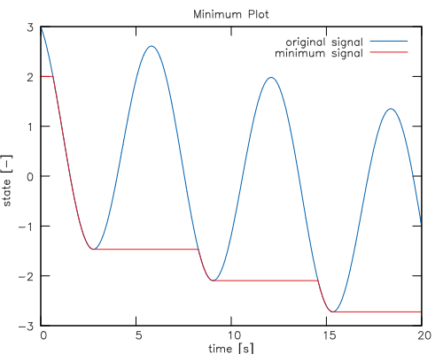

# LastLib

Experimental Modelica library for tool-generic FMU import to determine the online-minimum of a transient variable.
It was first presented at the 17th meeting of the Modelica Users’ Group Saxony.

## Library description

LastLib consists of tool-specific Modelica wrappers for the imported Last.fmu to obtain the value of the _last_ valid simulation step.

An overview of the library and early experiments are provided in

> Thomas Beutlich. Experiments and an FMI Idea on the Online-Minimum Problem. Presentation given at the 17th Modelisax Meeting, Dresden, Germany, November 2017. URL: [tinyurl.com/lastlibfmu](https://tinyurl.com/lastlibfmu).

### Supported Modelica tools

* Dymola (both Linux and Windows)
* OpenModelica (with C runtime)
* SimulationX

### Example

The primary use-case of LastLib is the calculation of the online-minimum.
The provided example model `MinimumTest.Test` demonstrates the usage of the `LastLib` within the minimum block `MinimumTest.Minimum`.

## License

LastLib is released under the terms of the Simplified BSD License.

## Acknowledgement

* The Last.fmu is based on the [FMU SDK](https://github.com/qtronic/fmusdk).

## Development and contribution

You may report any issues with using the [Issues](../../issues) button.

Contributions in shape of [Pull Requests](../../pulls) are always welcome.
